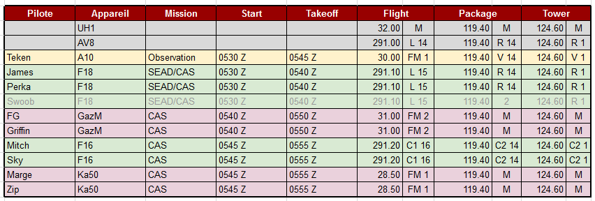
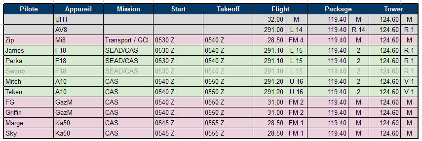
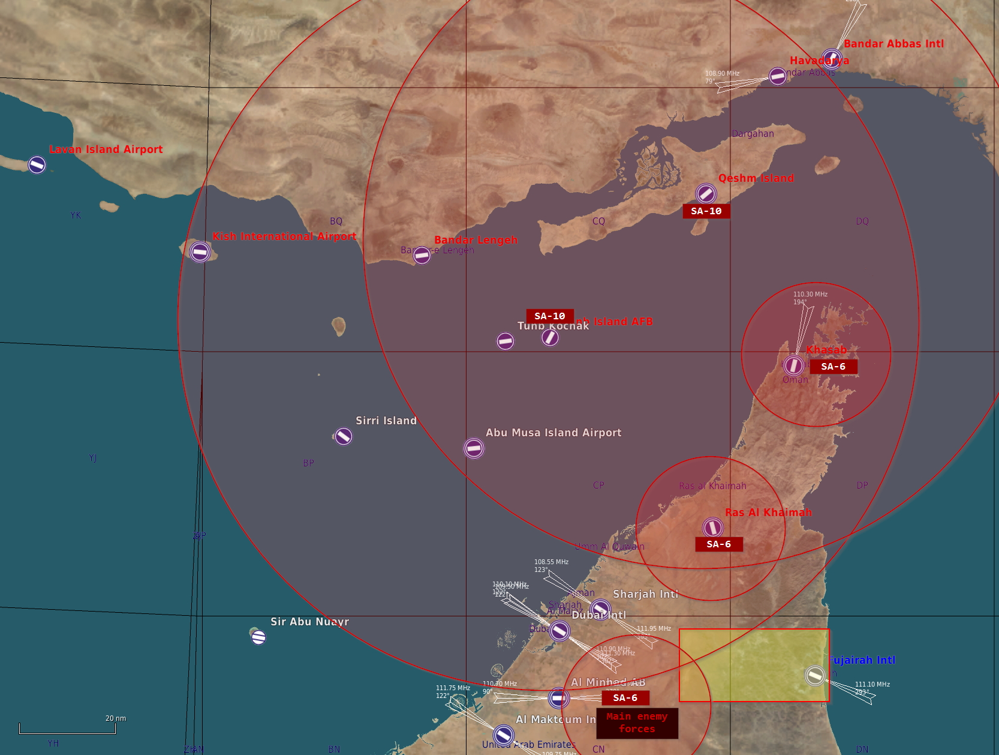
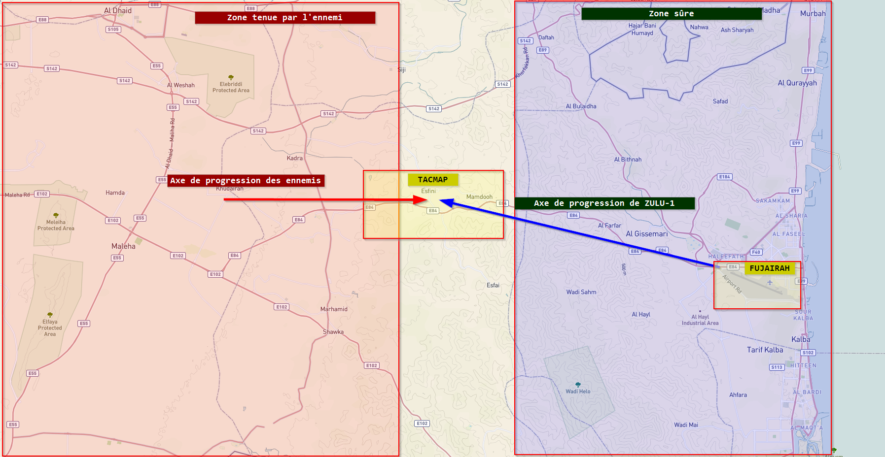
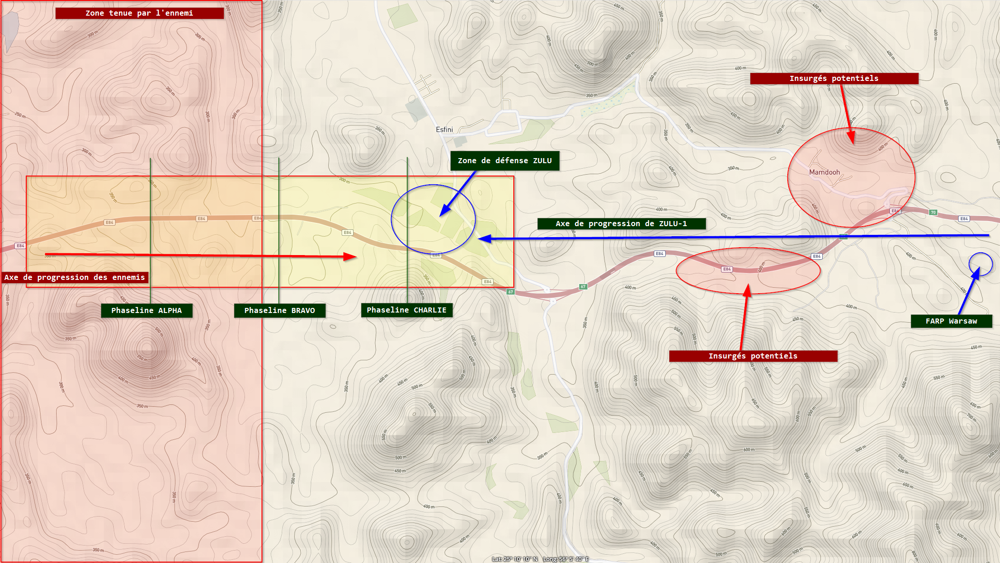
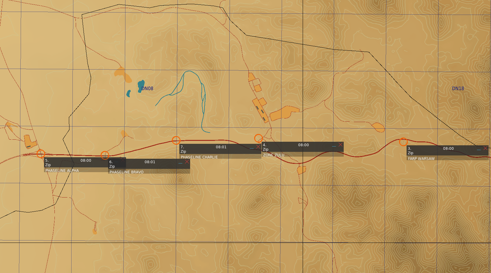
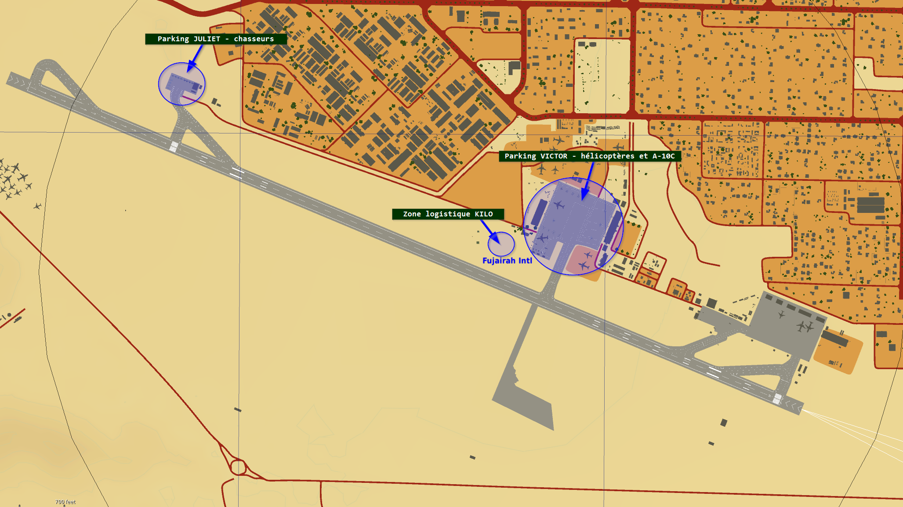

### Résumé des épisodes précédents

L'Iran, aidé par la Russie, a décidé d'envahir les Emirats Arabes Unis pour s'emparer des réserves de pétrole.
Partant des bases Iraniennes, les troupes russes ont déjà conquis une partie de la péninsule : du Nord au Sud, de Khasab à Al Dhaid , ils se sont arrêtés aux portes de Dubai qu'ils n'ont pas encore décidé d'envahir.

L'ONU est encore en train de délibérer pour arriver à une décision mais la situation est compliquée par le fait que la Russie siège au conseil de sécurité.

Pour arrêter en urgence la progression des Russes, un accord entre la France, les Etats-unis, le Royaume uni et l'Australie a été trouvé.
Un contingent composé de soldats et de matériel de ces quatre pays a pris pied à l'Est de la péninsule, dans la ville de Fujairah, dont il occupe l'aéroport.

Mais les Russes, qui ont pris connaissance de l'arrivée des forces de l'OTAN, ont décidé de mener une offensive éclair pour repousser à la mer les troupes alliées avant qu'elles ne soient vraiment en mesure de créer une tête de pont.

### Ordre de bataille

Au moins un régiment de cavalerie et deux régiments d'infanterie motorisée russes occupent le nord de la péninsule.

Les alliés n'ont qu'une brigade légère de cavalerie, assistée d'une compagnie de fantassins et de quelques pièces d'artillerie.
Par contre, de nombreux aéronefs ont été acheminés sur la base de Fujairah, et ils seront décisifs dans la bataille à venir.

### Situation

L'armée russe est stationnée à l'Ouest des montagnes qui séparent Fujairah du reste de la péninsule, et une compagnie de blindés est en route par l'autoroute E84 pour attaquer l'aéroport, faiblement défendu.
Cette compagnie est séparée en trois éléments distincts, d'une force de 15 à 20 blindés chacun.
Des batteries de SAM (SA-6) couvrent l'ouest des montagnes, et des SA-10 couvrent tout le nord de la péninsule.
En plus de ces SAM, des patrouilles de blindés de défense aérienne de courte à moyenne portée sont régulièrement aperçues juste à l'entrée ouest de la vallée occupée par l'E84.

Pour ne rien arranger, des séparatistes pro-iraniens se sont retranchés dans les montagnes, avec des fusils d'assaut, des RPG et des SA-18 fournis par les russes.

Les alliés ont décidé que le meilleur point de défense est le village de Esfani (baptisé ZULU), qui offre une belle ouverture sur la vallée que devront impérativement emprunter les blindés russes, marquée par les phaselines ALPHA, BRAVO et CHARLIE qu'il faudra tenir.

Malheureusement, seuls deux M1A2 Abrams accompagnés de deux M2A2 Bradley, deux LAV-25 et un système Roland ADS sont en état de combattre. Ils font route à toute vitesse vers la zone ZULU qu'ils devraient atteindre vers 0600Z.

**Il faut tenir !**

### Air Tasking Order

En fonction des participants (présence ou absence de Swoob) et de leurs choix d'appareils (Teken, Mitch, Sky) je vous propose les deux possibilités suivantes :

#### ATO#1 - Teken en observateur, Sky et Mitch en F16

#### ATO#2 - Teken et Mitch en A10, Sky avec Marge en KA50

### Cartes

Situation :

Tactique :

Le FARP Warsaw est équipé pour ravitailler les hélicoptères d'attaque en carburant et en munitions, et se trouve à moins de 15 km de ZULU.
S'il tombe, le ravitaillement sera plus difficile car il faudra rejoindre la base de Fujairah elle-même.

Points nommés :

- FUJAIRAH, 25 06' 39.55"N, 56 19' 38.36"E, 31m
- FARP WARSAW, 25 09' 46.06"N, 56 08' 20.63"E, 399m
- ZONE ZULU, 25 09' 48.98"N, 56 05' 34.12"E, 301m
- PHASELINE ALPHA, 25 09' 31.03"N, 56 01' 24.10"E, 229m
- PHASELINE BRAVO, 25 09' 29.78"N, 56 02' 37.68"E, 273m
- PHASELINE CHARLIE, 25 09' 45.98"N, 56 03' 59.46"E, 283m

Aéroport de Fujairah :

Des troupes sont disponibles sur la zone KILO pour être embarquées dans les hélicoptères de transport.

### Limites de matériel

Tous les avions / hélicos sont limités à 8 par type ; si on casse, c'est perdu ! Du coup essayez de ramener vos appareils !

Concernant l'armement, les limites ne concernent que les munitions les plus rares et les plus chères, comme :

- AGM88C x12
- CBU87 x20
- CBU97 x8
- GBU38 x12
- GBU12 x40
- AN/AAQ-28 x 4

Il n'y a pas de :

- JSOW
- JDAM autre que GBU38
- Bombe guidée autre que GBU12

### Remarques et technique

J'ai préparé un fichier OPERATION-ZULU.txt(operation-zulu.txt)  à déposer dans le répertoire *Parties Sauvegardées\DCS\Scratchpad* si vous utilisez le mod *Tech - In-Game Scratchpad* (voir [ce post](https://community.veaf.org/topic/303/ovgme-veaf-user-file-mods))
